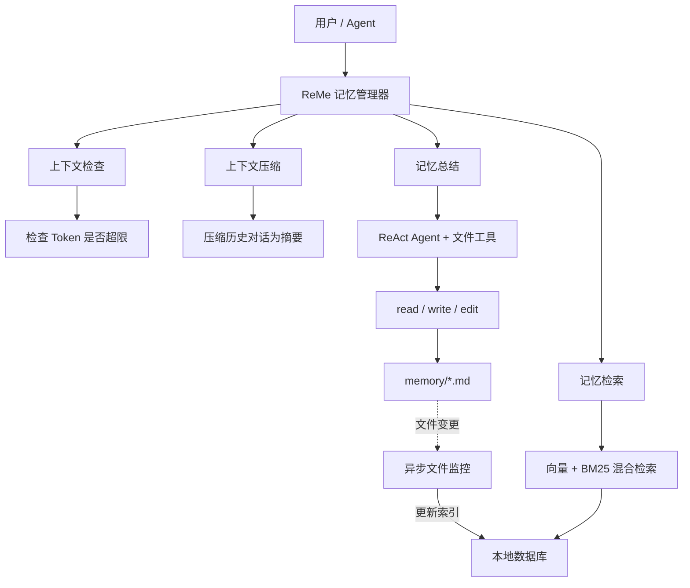
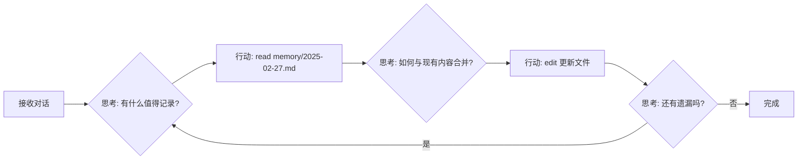
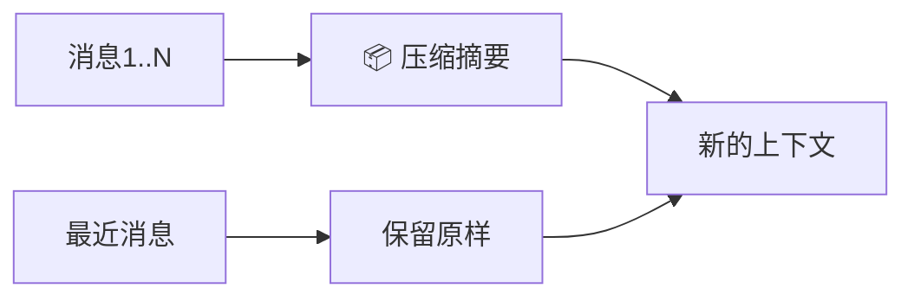
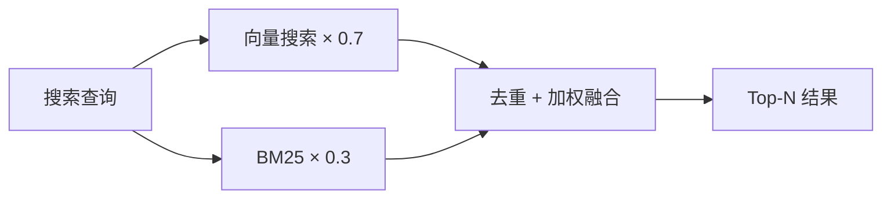

<p align="center">
 
</p>

<p align="center">
  <a href="https://pypi.org/project/reme-ai/"></a>
  <a href="https://pypi.org/project/reme-ai/"></a>
  <a href="https://pepy.tech/project/reme-ai/"></a>
  <a href="https://github.com/agentscope-ai/ReMe"></a>
</p>

<p align="center">
  <a href="./LICENSE"></a>
  <a href="./README.md"></a>
  <a href="./README_ZH.md"></a>
  <a href="https://github.com/agentscope-ai/ReMe"></a>
</p>

<p align="center">
  <strong>面向智能体的记忆管理工具包, Remember Me, Refine Me.</strong><br>
</p>

---

ReMe 是一个专为 **AI 智能体**打造的记忆管理框架，同时提供基于文件系统和基于向量库的记忆系统。

它解决智能体最核心的两个痛点：**对话太长就丢信息**，**新对话一张白纸**。

ReMe 让智能体拥有**真正的记忆力**——旧对话自动浓缩，重要信息持久保存，下次对话自动想起来。

---

# File Based ReMe

> 记忆即文件，文件即记忆

ReMe 将**记忆视为文件**——可读、可编辑、可复制。

| 传统记忆系统    | File Based ReMe |
|-----------|-----------------|
| 🗄️ 数据库存储 | 📝 Markdown 文件  |
| 🔒 不可见    | 👀 随时可读         |
| ❌ 难修改     | ✏️ 直接编辑         |
| 🚫 难迁移    | 📦 复制即迁移        |

```
.reme/
├── MEMORY.md          # 长期记忆：用户偏好、项目配置等不常变的信息
└── memory/
    └── YYYY-MM-DD.md  # 每日日志：当天的工作记录，压缩时自动写入
```

> 记忆设计受 [OpenClaw](https://github.com/openclaw/openclaw) 启发。

## 核心能力
[ReMeFb](reme/reme_fb.py) 是基于文件的记忆系统的核心类，就像一个**智能秘书**，帮你管理所有记忆相关的事务：

| 方法              | 功能           | 关键组件                                                                                                                                                                                                                 |
|-----------------|--------------|----------------------------------------------------------------------------------------------------------------------------------------------------------------------------------------------------------------------|
| `start`         | 🚀 启动记忆系统    | [BaseFileStore](reme/core/file_store/base_file_store.py)（本地数据库）、[BaseFileWatcher](reme/core/file_watcher/base_file_watcher.py)（文件监控）、[BaseEmbeddingModel](reme/core/embedding/base_embedding_model.py)（Embedding 缓存） |
| `close`         | 📕 关闭并保存     | 关闭数据库、停止文件监控、保存 Embedding 缓存                                                                                                                                                                                         |
| `context_check` | 📏 检查上下文是否超限 | [FbContextChecker](reme/memory/file_based/fb_context_checker.py)                                                                                                                                                     |
| `compact`       | 📦 压缩历史对话为摘要 | [FbCompactor](reme/memory/file_based/fb_compactor.py)                                                                                                                                                                |
| `summary`       | 📝 将重要记忆写入文件 | [FbSummarizer](reme/memory/file_based/fb_summarizer.py)                                                                                                                                                              |
| `memory_search` | 🔍 语义搜索记忆    | [FbMemorySearch](reme/memory/file_based/fb_memory_search.py)                                                                                                                                                         |
| `memory_get`    | 📖 读取指定记忆文件  | [FbMemoryGet](reme/memory/file_based/fb_memory_get.py)                                                                                                                                                               |
---


## ⭐️ 给项目点个星

<table border="0" cellspacing="0" cellpadding="0" style="border: none;">
  <tr style="border: none;">
    <td width="10%" style="border: none; vertical-align: middle; text-align: center;">
      <strong>马<br>上<br>有<br>钱</strong>
    </td>
    <td width="80%" style="border: none;">
      <video src="https://github.com/user-attachments/assets/befa7e40-63ba-4db2-8251-516024616e00" autoplay muted loop controls></video>
    </td>
    <td width="10%" style="border: none; vertical-align: middle; text-align: center;">
      <strong>马<br>到<br>成<br>功</strong>
    </td>
  </tr>
</table>
如果你觉得 ReMe 有用，请给项目点个星 ⭐️，这将是对我们最大的鼓励！

---

## 核心架构



## 记忆总结：ReAct + 文件工具

[FbSummarizer](reme/memory/file_based/fb_summarizer.py) 是记忆总结的核心组件，它采用 **ReAct（推理 + 行动）** 模式——让 AI
像人一样"边想边做"：



### 文件工具集

FbSummarizer 配备了一套文件操作工具，让 AI 能够直接操作记忆文件：

| 工具      | 功能     | 使用场景         |
|---------|--------|--------------|
| `read`  | 读取文件内容 | 查看现有记忆，避免重复  |
| `write` | 覆盖写入文件 | 创建新记忆文件或大幅重构 |
| `edit`  | 编辑文件局部 | 追加新内容或修改特定部分 |

## 上下文压缩

当对话过长时，[FbCompactor](reme/memory/file_based/fb_compactor.py) 负责将历史对话压缩为精华摘要——就像写**会议纪要**
，把冗长的讨论浓缩成关键要点。



压缩摘要包含继续工作所需的关键信息：

| 内容     | 说明            |
|--------|---------------|
| 🎯 目标  | 用户想要完成什么      |
| ⚙️ 约束  | 用户提到的要求和偏好    |
| 📈 进展  | 已完成/进行中/阻塞的任务 |
| 🔑 决策  | 做出的决策及原因      |
| 📌 上下文 | 文件路径、函数名等关键数据 |

## 记忆检索

[MemorySearch](reme/memory/tools/chunk/memory_search.py) 提供**向量 + BM25 混合检索**能力，两种方式互补：

| 检索方式        | 优势              | 劣势             |
|-------------|-----------------|----------------|
| **向量语义**    | 捕捉意义相近但措辞不同的内容  | 对精确 token 匹配较弱 |
| **BM25 全文** | 精确 token 命中效果极佳 | 无法理解同义词和改写     |

**融合机制**：同时使用两路召回，按权重加权求和（向量 0.7 + BM25 0.3），确保无论是「自然语言提问」还是「精确查找」都能获得可靠结果。



---

## ReMeCli：基于 File Based Memory 的终端助手

#### 什么时候会写记忆？

| 场景               | 写到哪                    | 怎么触发                 |
|------------------|------------------------|----------------------|
| 上下文超长自动压缩        | `memory/YYYY-MM-DD.md` | 后台自动                 |
| 用户执行 `/compact`  | `memory/YYYY-MM-DD.md` | 手动压缩 + 后台保存          |
| 用户执行 `/new`      | `memory/YYYY-MM-DD.md` | 新对话 + 后台保存           |
| 用户说"记住这个"        | `MEMORY.md` 或日志        | Agent 用 `write` 工具写入 |
| Agent 发现了重要决策/偏好 | `MEMORY.md`            | Agent 主动写            |

#### 记忆检索工具

| 方式   | 工具              | 什么时候用      | 举例                       |
|------|-----------------|------------|--------------------------|
| 语义搜索 | `memory_search` | 不确定记在哪，模糊找 | "之前关于部署的讨论"              |
| 直接读  | `read`          | 知道是哪天、哪个文件 | 读 `memory/2025-02-13.md` |

搜索用的是**向量 + BM25 混合检索**（向量权重 0.7，BM25 权重 0.3），自然语言和精确关键词都能搜到。

#### 内置工具

| 工具              | 干什么      | 细节                                     |
|-----------------|----------|----------------------------------------|
| `memory_search` | 搜记忆      | MEMORY.md 和 memory/*.md 里做向量+BM25 混合检索 |
| `bash`          | 跑命令      | 执行 bash 命令，有超时和输出截断                    |
| `ls`            | 看目录      | 列目录结构                                  |
| `read`          | 读文件      | 文本和图片都行，支持分段读                          |
| `edit`          | 改文件      | 精确匹配文本后替换                              |
| `write`         | 写文件      | 创建或覆盖，自动建目录                            |
| `execute_code`  | 跑 Python | 运行代码片段                                 |
| `web_search`    | 联网搜索     | 通过 Tavily 或 DashScope 搜                |

## 快速开始

### 安装

```bash
pip install -U reme-ai
```

### 环境变量配置

API 密钥通过环境变量设置，可以写在项目根目录的 `.env` 里：

| 环境变量                      | 说明                   | 示例                                                  |
|---------------------------|----------------------|-----------------------------------------------------|
| `REME_LLM_API_KEY`        | LLM 的 API Key        | `sk-xxx`                                            |
| `REME_LLM_BASE_URL`       | LLM 的 Base URL       | `https://dashscope.aliyuncs.com/compatible-mode/v1` |
| `REME_EMBEDDING_API_KEY`  | Embedding 的 API Key  | `sk-xxx`                                            |
| `REME_EMBEDDING_BASE_URL` | Embedding 的 Base URL | `https://dashscope.aliyuncs.com/compatible-mode/v1` |

> 没有 embedding 服务的话搜索效果会打折扣，记得同时设 `vector_enabled=false`。

**如果要在ReMeCli中使用联网搜索（可选）**

| 环境变量                | 说明                 |
|---------------------|--------------------|
| `TAVILY_API_KEY`    | Tavily 搜索 API Key  |
| `DASHSCOPE_API_KEY` | 百炼 LLM（带搜索）API Key |

> 二选一就行，有 Tavily 优先用 Tavily。

### package使用

```python
import asyncio
from reme import ReMeFb


async def main():
    # 初始化并启动
    reme = ReMeFb(
        working_dir=".reme",
        default_llm_config={
            "model_name": "",
        }
    )
    await reme.start()

    messages = [
        {"role": "user", "content": "我喜欢用 Python 3.12"},
        {"role": "assistant", "content": "好的，已记录你偏好 Python 3.12"},
    ]

    # 检查上下文是否超限
    result = await reme.context_check(messages)
    print(f"压缩结论: {result}")

    # 压缩对话为摘要
    summary = await reme.compact(messages_to_summarize=messages)
    print(f"摘要: {summary}")

    # 将重要记忆写入文件（ReAct Agent 自动操作）
    await reme.summary(messages=messages, date="2025-02-28")

    # 语义搜索记忆
    results = await reme.memory_search(query="Python 版本偏好", max_results=5)
    print(f"搜索结果: {results}")

    # 读取指定记忆文件
    content = await reme.memory_get(path="MEMORY.md")
    print(f"记忆内容: {content}")

    # 关闭（保存 Embedding 缓存、停止文件监控）
    await reme.close()


if __name__ == "__main__":
    asyncio.run(main())
```

### 启动ReMeCli

```bash
remecli config=cli
```

启动后自动加载 [cli.yaml](reme/config/cli.yaml)，然后就可以直接聊了。ReMe 在后台自动处理压缩和记忆。

### 系统命令

对话里输入 `/` 开头的命令控制状态：

| 命令         | 说明                  | 需要等 |
|------------|---------------------|-----|
| `/compact` | 手动压缩当前对话，同时后台存到长期记忆 | 是   |
| `/new`     | 开始新对话，历史后台保存到长期记忆   | 否   |
| `/clear`   | 清空一切，**不保存**        | 否   |
| `/history` | 看当前对话里未压缩的消息        | 否   |
| `/help`    | 看命令列表               | 否   |
| `/exit`    | 退出                  | 否   |

**三个命令的区别**

| 命令         | 压缩摘要  | 长期记忆 | 消息历史  |
|------------|-------|------|-------|
| `/compact` | 生成新摘要 | 保存   | 保留最近的 |
| `/new`     | 清空    | 保存   | 清空    |
| `/clear`   | 清空    | 不保存  | 清空    |

> `/clear` 是真删，删了就没了，不会存到任何地方。

---

# Vector Based ReMe

Coming soon...


---

## 📰 最新进展

- **[2026-02]** 💻 ReMeCli：终端 AI 聊天助手，内置记忆管理能力。当对话过长时自动将旧内容压缩为摘要以释放上下文空间，同时将重要信息以
  Markdown 文件持久化存储，供未来会话自动检索使用。记忆设计灵感来源于 [OpenClaw](https://github.com/openclaw/openclaw)。
    - [快速开始](docs/cli/quick_start_en.md)
    - 输入 `/horse` 触发马年彩蛋——烟花、奔马动画和随机马年祝福。


- **[2025-12]** 📄 我们的程序性（任务）记忆论文已在 [arXiv](https://arxiv.org/abs/2512.10696) 发布

---

# ReMe 旧方案 0.2.x.x

ReMe 是一个**模块化的记忆管理工具包**，为 AI 智能体提供统一的记忆能力——支持在用户、任务与智能体之间提取、复用与共享记忆。

智能体的记忆可以被视为：

```text
Agent Memory = Long-Term Memory + Short-Term Memory
             = (Personal + Task + Tool) Memory + (Working Memory)
```

- **个人记忆（Personal Memory）**：理解用户偏好并适应上下文
- **任务记忆（Task Memory）**：从经验中学习并在类似任务中表现更好
- **工具记忆（Tool Memory）**：基于历史表现优化工具选择和参数使用
- **工作记忆（Working Memory）**：管理长运行智能体的短期上下文，避免上下文溢出

## ✨ 架构设计

<p align="center">
 
</p>

ReMe 提供了一个**模块化的记忆管理工具包**，具有可插拔的组件，可以集成到任何智能体框架中。系统包括：

#### 🧠 **任务记忆 / 经验记忆（Task Memory/Experience）**

可在不同智能体之间复用的程序性知识：

- **成功模式识别**：识别有效策略并理解其背后的原理
- **失败分析学习**：从错误中学习，避免重复踩坑
- **对比式模式**：通过多条采样轨迹的对比获取更有价值的记忆
- **验证模式**：通过验证模块确认提炼出的经验是否有效

了解如何使用任务记忆可参考：[任务记忆文档](docs/task_memory/task_memory.md)

#### 👤 **个人记忆（Personal Memory）**

面向特定用户的情境化长期记忆：

- **个体偏好**：记录用户的习惯、偏好与交互风格
- **情境自适应**：基于时间与上下文动态管理记忆
- **渐进式学习**：在长期多轮交互中不断加深对用户的理解
- **时间敏感**：在记忆检索与整合中考虑时间因素

了解如何使用个人记忆可参考：[个人记忆文档](docs/personal_memory/personal_memory.md)

#### 🔧 **工具记忆（Tool Memory）**

基于真实调用数据的工具选择与使用优化：

- **历史表现追踪**：记录成功率、调用耗时与 Token 成本
- **LLM-as-Judge 评估**：提供工具成功 / 失败原因的定性洞察
- **参数优化**：从历史成功调用中学习最优参数配置
- **动态指南**：将静态工具描述演化为可持续更新的「活文档」

了解如何使用工具记忆可参考：[工具记忆文档](docs/tool_memory/tool_memory.md)

#### 🧠 **工作记忆（Working Memory）**

面向长流程智能体的短期上下文记忆，通过**消息卸载与重载（message offload & reload）**实现：

- **消息卸载（Message Offload）**：将体积巨大的工具输出压缩为外部文件或 LLM 摘要
- **消息重载（Message Reload）**：按需搜索（`grep_working_memory`）并读取（`read_working_memory`）已卸载的内容

📖 **概念与 API：**

- 消息卸载概览：[Message Offload](docs/work_memory/message_offload.md)
- 卸载 /
  重载算子：[Message Offload Ops](docs/work_memory/message_offload_ops.md)、[Message Reload Ops](docs/work_memory/message_reload_ops.md)

💻 **端到端 Demo：**

- 工作记忆快速上手：[Working Memory Quick Start](docs/cookbook/working/quick_start.md)
- 带工作记忆的 ReAct
  智能体：[react_agent_with_working_memory.py](cookbook/working_memory/react_agent_with_working_memory.py)
- 可运行 Demo：[work_memory_demo.py](cookbook/working_memory/work_memory_demo.py)

---

## 🛠️ 安装

### 通过 PyPI 安装（推荐）

```bash
pip install reme-ai
```

### 从源码安装

```bash
git clone https://github.com/agentscope-ai/ReMe.git
cd ReMe
pip install .
```

### 环境变量配置

复制 `example.env` 为 `.env` 并按需修改：

```bash
FLOW_LLM_API_KEY=sk-xxxx
FLOW_LLM_BASE_URL=https://xxxx/v1
FLOW_EMBEDDING_API_KEY=sk-xxxx
FLOW_EMBEDDING_BASE_URL=https://xxxx/v1
```

---

## 🚀 快速开始

### 启动 HTTP 服务

```bash
reme \
  backend=http \
  http.port=8002 \
  llm.default.model_name=qwen3-30b-a3b-thinking-2507 \
  embedding_model.default.model_name=text-embedding-v4 \
  vector_store.default.backend=local
```

### 启动 MCP Server

```bash
reme \
  backend=mcp \
  mcp.transport=stdio \
  llm.default.model_name=qwen3-30b-a3b-thinking-2507 \
  embedding_model.default.model_name=text-embedding-v4 \
  vector_store.default.backend=local
```

### 核心 API 用法

#### 任务记忆管理

```python
import requests

# 经验总结：从执行轨迹中学习
response = requests.post("http://localhost:8002/summary_task_memory", json={
    "workspace_id": "task_workspace",
    "trajectories": [
        {"messages": [{"role": "user", "content": "Help me create a project plan"}], "score": 1.0}
    ]
})

# 记忆检索：获取相关经验
response = requests.post("http://localhost:8002/retrieve_task_memory", json={
    "workspace_id": "task_workspace",
    "query": "How to efficiently manage project progress?",
    "top_k": 1
})
```

<details>
<summary>Python 导入版本</summary>

```python
import asyncio
from reme_ai import ReMeApp


async def main():
    async with ReMeApp(
            "llm.default.model_name=qwen3-30b-a3b-thinking-2507",
            "embedding_model.default.model_name=text-embedding-v4",
            "vector_store.default.backend=memory"
    ) as app:
        # 经验总结：从执行轨迹中学习
        result = await app.async_execute(
            name="summary_task_memory",
            workspace_id="task_workspace",
            trajectories=[
                {
                    "messages": [
                        {"role": "user", "content": "Help me create a project plan"}
                    ],
                    "score": 1.0
                }
            ]
        )
        print(result)

        # 记忆检索：获取相关经验
        result = await app.async_execute(
            name="retrieve_task_memory",
            workspace_id="task_workspace",
            query="How to efficiently manage project progress?",
            top_k=1
        )
        print(result)


if __name__ == "__main__":
    asyncio.run(main())
```

</details>

<details>
<summary>curl 版本</summary>

```bash
# 经验总结：从执行轨迹中学习
curl -X POST http://localhost:8002/summary_task_memory \
  -H "Content-Type: application/json" \
  -d '{
    "workspace_id": "task_workspace",
    "trajectories": [
      {"messages": [{"role": "user", "content": "Help me create a project plan"}], "score": 1.0}
    ]
  }'

# 记忆检索：获取相关经验
curl -X POST http://localhost:8002/retrieve_task_memory \
  -H "Content-Type: application/json" \
  -d '{
    "workspace_id": "task_workspace",
    "query": "How to efficiently manage project progress?",
    "top_k": 1
  }'
```

</details>

#### 个人记忆管理

```python
# 记忆整合：从用户交互中学习
response = requests.post("http://localhost:8002/summary_personal_memory", json={
    "workspace_id": "task_workspace",
    "trajectories": [
        {"messages":
            [
                {"role": "user", "content": "I like to drink coffee while working in the morning"},
                {"role": "assistant",
                 "content": "I understand, you prefer to start your workday with coffee to stay energized"}
            ]
        }
    ]
})

# 记忆检索：获取个人记忆片段
response = requests.post("http://localhost:8002/retrieve_personal_memory", json={
    "workspace_id": "task_workspace",
    "query": "What are the user's work habits?",
    "top_k": 5
})
```

<details>
<summary>Python 导入版本</summary>

```python
import asyncio
from reme_ai import ReMeApp


async def main():
    async with ReMeApp(
            "llm.default.model_name=qwen3-30b-a3b-thinking-2507",
            "embedding_model.default.model_name=text-embedding-v4",
            "vector_store.default.backend=memory"
    ) as app:
        # 记忆整合：从用户交互中学习
        result = await app.async_execute(
            name="summary_personal_memory",
            workspace_id="task_workspace",
            trajectories=[
                {
                    "messages": [
                        {"role": "user", "content": "I like to drink coffee while working in the morning"},
                        {"role": "assistant",
                         "content": "I understand, you prefer to start your workday with coffee to stay energized"}
                    ]
                }
            ]
        )
        print(result)

        # 记忆检索：获取个人记忆片段
        result = await app.async_execute(
            name="retrieve_personal_memory",
            workspace_id="task_workspace",
            query="What are the user's work habits?",
            top_k=5
        )
        print(result)


if __name__ == "__main__":
    asyncio.run(main())
```

</details>

<details>
<summary>curl 版本</summary>

```bash
# 记忆整合：从用户交互中学习
curl -X POST http://localhost:8002/summary_personal_memory \
  -H "Content-Type: application/json" \
  -d '{
    "workspace_id": "task_workspace",
    "trajectories": [
      {"messages": [
        {"role": "user", "content": "I like to drink coffee while working in the morning"},
        {"role": "assistant", "content": "I understand, you prefer to start your workday with coffee to stay energized"}
      ]}
    ]
  }'

# 记忆检索：获取个人记忆片段
curl -X POST http://localhost:8002/retrieve_personal_memory \
  -H "Content-Type: application/json" \
  -d '{
    "workspace_id": "task_workspace",
    "query": "What are the user'\''s work habits?",
    "top_k": 5
  }'
```

</details>

#### 工具记忆管理

```python
import requests

# 记录工具调用结果
response = requests.post("http://localhost:8002/add_tool_call_result", json={
    "workspace_id": "tool_workspace",
    "tool_call_results": [
        {
            "create_time": "2025-10-21 10:30:00",
            "tool_name": "web_search",
            "input": {"query": "Python asyncio tutorial", "max_results": 10},
            "output": "Found 10 relevant results...",
            "token_cost": 150,
            "success": True,
            "time_cost": 2.3
        }
    ]
})

# 从历史生成使用指南
response = requests.post("http://localhost:8002/summary_tool_memory", json={
    "workspace_id": "tool_workspace",
    "tool_names": "web_search"
})

# 在使用前检索工具指南
response = requests.post("http://localhost:8002/retrieve_tool_memory", json={
    "workspace_id": "tool_workspace",
    "tool_names": "web_search"
})
```

<details>
<summary>Python 导入版本</summary>

```python
import asyncio
from reme_ai import ReMeApp


async def main():
    async with ReMeApp(
            "llm.default.model_name=qwen3-30b-a3b-thinking-2507",
            "embedding_model.default.model_name=text-embedding-v4",
            "vector_store.default.backend=memory"
    ) as app:
        # 记录工具调用结果
        result = await app.async_execute(
            name="add_tool_call_result",
            workspace_id="tool_workspace",
            tool_call_results=[
                {
                    "create_time": "2025-10-21 10:30:00",
                    "tool_name": "web_search",
                    "input": {"query": "Python asyncio tutorial", "max_results": 10},
                    "output": "Found 10 relevant results...",
                    "token_cost": 150,
                    "success": True,
                    "time_cost": 2.3
                }
            ]
        )
        print(result)

        # 从历史生成使用指南
        result = await app.async_execute(
            name="summary_tool_memory",
            workspace_id="tool_workspace",
            tool_names="web_search"
        )
        print(result)

        # 在使用前检索工具指南
        result = await app.async_execute(
            name="retrieve_tool_memory",
            workspace_id="tool_workspace",
            tool_names="web_search"
        )
        print(result)


if __name__ == "__main__":
    asyncio.run(main())
```

</details>

<details>
<summary>curl 版本</summary>

```bash
# 记录工具调用结果
curl -X POST http://localhost:8002/add_tool_call_result \
  -H "Content-Type: application/json" \
  -d '{
    "workspace_id": "tool_workspace",
    "tool_call_results": [
      {
        "create_time": "2025-10-21 10:30:00",
        "tool_name": "web_search",
        "input": {"query": "Python asyncio tutorial", "max_results": 10},
        "output": "Found 10 relevant results...",
        "token_cost": 150,
        "success": true,
        "time_cost": 2.3
      }
    ]
  }'

# 从历史生成使用指南
curl -X POST http://localhost:8002/summary_tool_memory \
  -H "Content-Type: application/json" \
  -d '{
    "workspace_id": "tool_workspace",
    "tool_names": "web_search"
  }'

# 在使用前检索工具指南
curl -X POST http://localhost:8002/retrieve_tool_memory \
  -H "Content-Type: application/json" \
  -d '{
    "workspace_id": "tool_workspace",
    "tool_names": "web_search"
  }'
```

</details>

#### 工作记忆管理

```python
import requests

# 对长对话 / 长流程的工作记忆进行压缩与总结
response = requests.post("http://localhost:8002/summary_working_memory", json={
    "messages": [
        {
            "role": "system",
            "content": "You are a helpful assistant. First use `Grep` to find the line numbers that match the keywords or regular expressions, and then use `ReadFile` to read the code around those locations. If no matches are found, never give up; try different parameters, such as searching with only part of the keywords. After `Grep`, use the `ReadFile` command to view content starting from a specified `offset` and `limit`, and do not exceed 100 lines. If the current content is insufficient, you can continue trying different `offset` and `limit` values with the `ReadFile` command."
        },
        {
            "role": "user",
            "content": "搜索下reme项目的的README内容"
        },
        {
            "role": "assistant",
            "content": "",
            "tool_calls": [
                {
                    "index": 0,
                    "id": "call_6596dafa2a6a46f7a217da",
                    "function": {
                        "arguments": "{\"query\": \"readme\"}",
                        "name": "web_search"
                    },
                    "type": "function"
                }
            ]
        },
        {
            "role": "tool",
            "content": "ultra large context , over 50000 tokens......"
        },
        {
            "role": "user",
            "content": "根据readme回答task memory在appworld的效果是多少，需要具体的数值"
        }
    ],
    "working_summary_mode": "auto",
    "compact_ratio_threshold": 0.75,
    "max_total_tokens": 20000,
    "max_tool_message_tokens": 2000,
    "group_token_threshold": 4000,
    "keep_recent_count": 2,
    "store_dir": "test_working_memory",
    "chat_id": "demo_chat_id"
})
```

<details>
<summary>Python 导入版本</summary>

```python
import asyncio
from reme_ai import ReMeApp


async def main():
    async with ReMeApp(
            "llm.default.model_name=qwen3-30b-a3b-thinking-2507",
            "embedding_model.default.model_name=text-embedding-v4",
            "vector_store.default.backend=memory"
    ) as app:
        # 对长对话 / 长流程的工作记忆进行压缩与总结
        result = await app.async_execute(
            name="summary_working_memory",
            messages=[
                {
                    "role": "system",
                    "content": "You are a helpful assistant. First use `Grep` to find the line numbers that match the keywords or regular expressions, and then use `ReadFile` to read the code around those locations. If no matches are found, never give up; try different parameters, such as searching with only part of the keywords. After `Grep`, use the `ReadFile` command to view content starting from a specified `offset` and `limit`, and do not exceed 100 lines. If the current content is insufficient, you can continue trying different `offset` and `limit` values with the `ReadFile` command."
                },
                {
                    "role": "user",
                    "content": "搜索下reme项目的的README内容"
                },
                {
                    "role": "assistant",
                    "content": "",
                    "tool_calls": [
                        {
                            "index": 0,
                            "id": "call_6596dafa2a6a46f7a217da",
                            "function": {
                                "arguments": "{\"query\": \"readme\"}",
                                "name": "web_search"
                            },
                            "type": "function"
                        }
                    ]
                },
                {
                    "role": "tool",
                    "content": "ultra large context , over 50000 tokens......"
                },
                {
                    "role": "user",
                    "content": "根据readme回答task memory在appworld的效果是多少，需要具体的数值"
                }
            ],
            working_summary_mode="auto",
            compact_ratio_threshold=0.75,
            max_total_tokens=20000,
            max_tool_message_tokens=2000,
            group_token_threshold=4000,
            keep_recent_count=2,
            store_dir="test_working_memory",
            chat_id="demo_chat_id",
        )
        print(result)


if __name__ == "__main__":
    asyncio.run(main())
```

</details>

<details>
<summary>curl 版本</summary>

```bash
curl -X POST http://localhost:8002/summary_working_memory \
  -H "Content-Type: application/json" \
  -d '{
    "messages": [
      {
        "role": "system",
        "content": "You are a helpful assistant. First use `Grep` to find the line numbers that match the keywords or regular expressions, and then use `ReadFile` to read the code around those locations. If no matches are found, never give up; try different parameters, such as searching with only part of the keywords. After `Grep`, use the `ReadFile` command to view content starting from a specified `offset` and `limit`, and do not exceed 100 lines. If the current content is insufficient, you can continue trying different `offset` and `limit` values with the `ReadFile` command."
      },
      {
        "role": "user",
        "content": "搜索下reme项目的的README内容"
      },
      {
        "role": "assistant",
        "content": "",
        "tool_calls": [
          {
            "index": 0,
            "id": "call_6596dafa2a6a46f7a217da",
            "function": {
              "arguments": "{\"query\": \"readme\"}",
              "name": "web_search"
            },
            "type": "function"
          }
        ]
      },
      {
        "role": "tool",
        "content": "ultra large context , over 50000 tokens......"
      },
      {
        "role": "user",
        "content": "根据readme回答task memory在appworld的效果是多少，需要具体的数值"
      }
    ],
    "working_summary_mode": "auto",
    "compact_ratio_threshold": 0.75,
    "max_total_tokens": 20000,
    "max_tool_message_tokens": 2000,
    "group_token_threshold": 4000,
    "keep_recent_count": 2,
    "store_dir": "test_working_memory",
    "chat_id": "demo_chat_id"
  }'
```

</details>

---

## 📦 开箱即用的记忆库

ReMe 提供一个**记忆库**，包含预先提取的、生产就绪的记忆，智能体可以立即加载和使用：

### 可用记忆包

| 记忆包                  | 领域   | 规模       | 描述                     |
|----------------------|------|----------|------------------------|
| **`appworld.jsonl`** | 任务执行 | ~100 条记忆 | 复杂任务规划模式、多步骤工作流和错误恢复策略 |
| **`bfcl_v3.jsonl`**  | 工具使用 | ~150 条记忆 | 函数调用模式、参数优化和工具选择策略     |

### 加载预构建记忆

```python
# 加载内置记忆
response = requests.post("http://localhost:8002/vector_store", json={
    "workspace_id": "appworld",
    "action": "load",
    "path": "./docs/library/"
})

# 查询相关记忆
response = requests.post("http://localhost:8002/retrieve_task_memory", json={
    "workspace_id": "appworld",
    "query": "How to navigate to settings and update user profile?",
    "top_k": 1
})
```

<details>
<summary>Python 导入版本</summary>

```python
import asyncio
from reme_ai import ReMeApp


async def main():
    async with ReMeApp(
            "llm.default.model_name=qwen3-30b-a3b-thinking-2507",
            "embedding_model.default.model_name=text-embedding-v4",
            "vector_store.default.backend=memory"
    ) as app:
        # 加载内置记忆
        result = await app.async_execute(
            name="vector_store",
            workspace_id="appworld",
            action="load",
            path="./docs/library/"
        )
        print(result)

        # 查询相关记忆
        result = await app.async_execute(
            name="retrieve_task_memory",
            workspace_id="appworld",
            query="How to navigate to settings and update user profile?",
            top_k=1
        )
        print(result)


if __name__ == "__main__":
    asyncio.run(main())
```

</details>

---

## 🧪 实验结果

### 🌍 [Appworld 实验](docs/cookbook/appworld/quickstart.md)

我们在 Appworld 环境上使用 Qwen3-8B（非思考模式）进行评测：

| 方法      | Avg@4               | Pass@4              |
|---------|---------------------|---------------------|
| 无 ReMe  | 0.1497              | 0.3285              |
| 使用 ReMe | 0.1706 **(+2.09%)** | 0.3631 **(+3.46%)** |

Pass@K 衡量在生成 K 个候选中，至少一个成功完成任务（score=1）的概率。
当前实验使用的是内部 AppWorld 环境，可能与对外版本存在轻微差异。

关于如何复现实验的更多细节，见 [quickstart.md](docs/cookbook/appworld/quickstart.md)。

### 🔧 [BFCL-V3 实验](docs/cookbook/bfcl/quickstart.md)

我们在 BFCL-V3 multi-turn-base 任务（随机划分 50 train / 150 val）上，使用 Qwen3-8B（思考模式）进行评测：

| 方法      | Avg@4               | Pass@4              |
|---------|---------------------|---------------------|
| 无 ReMe  | 0.4033              | 0.5955              |
| 使用 ReMe | 0.4450 **(+4.17%)** | 0.6577 **(+6.22%)** |

### 🧊 [Frozenlake 实验](docs/cookbook/frozenlake/quickstart.md)

|                                               无 ReMe                                                |                                               使用 ReMe                                               |
|:---------------------------------------------------------------------------------------------------:|:---------------------------------------------------------------------------------------------------:|
| <p align="center"></p> | <p align="center"></p> |

我们在 100 张随机 frozenlake 地图上，使用 qwen3-8b 进行测试：

| 方法      | 通过率              |
|---------|------------------|
| 无 ReMe  | 0.66             |
| 使用 ReMe | 0.72 **(+6.0%)** |

更多复现实验细节见 [quickstart.md](docs/cookbook/frozenlake/quickstart.md)。

### 🛠️ [工具记忆基准](docs/tool_memory/tool_bench.md)

我们在一个受控基准上，使用三个模拟搜索工具与 Qwen3-30B-Instruct 评估工具记忆的效果：

| 场景            | 平均分       | 提升          |
|---------------|-----------|-------------|
| 训练集（无记忆）      | 0.650     | -           |
| 测试集（无记忆）      | 0.672     | 基线          |
| **测试集（使用记忆）** | **0.772** | **+14.88%** |

**关键结论：**

- 工具记忆可以基于历史表现进行数据驱动的工具选择
- 通过学习参数配置，成功率约提升 15%

更多细节见 [tool_bench.md](docs/tool_memory/tool_bench.md)
与实现代码 [run_reme_tool_bench.py](cookbook/tool_memory/run_reme_tool_bench.py)。

---

## 📚 资源

### 快速入门

- **[Quick Start](./cookbook/simple_demo)**：实用示例，可立即使用
    - [工具记忆 Demo](cookbook/simple_demo/use_tool_memory_demo.py)：工具记忆的完整生命周期演示
    - [工具记忆基准](cookbook/tool_memory/run_reme_tool_bench.py)：评估工具记忆效果

### 集成指南

- **[直接 Python 导入](docs/cookbook/working/quick_start.md)**：将 ReMe 直接嵌入到你的智能体代码中
- **[HTTP 服务 API](docs/vector_store_api_guide.md)**：用于多智能体系统的 RESTful API
- **[MCP 协议](docs/mcp_quick_start.md)**：与 Claude Desktop 和 MCP 兼容客户端集成

### 记忆系统配置

- **[个人记忆](docs/personal_memory)**：用户偏好学习和上下文自适应
- **[任务记忆](docs/task_memory)**：程序性知识提取和复用
- **[工具记忆](docs/tool_memory)**：数据驱动的工具选择和优化
- **[工作记忆](docs/work_memory/message_offload.md)**：长流程智能体的短期上下文管理

### 高级主题

- **[算子管道](reme_ai/config/default.yaml)**：通过修改算子链来自定义记忆处理工作流
- **[向量存储后端](docs/vector_store_api_guide.md)**：配置本地、Elasticsearch、Qdrant 或 ChromaDB 存储
- **[案例集](./cookbook)**：真实场景的用例和最佳实践

---

## ⭐ 社区与支持

- **Star & Watch**：Star 可以让更多智能体开发者发现 ReMe；Watch 能帮助你第一时间获知新版本与特性。
- **分享你的成果**：在 Issue 或 Discussion 中分享 ReMe 为你的智能体解锁了什么——我们非常乐意展示社区的优秀案例。
- **需要新功能？** 提交 Feature Request，我们将一起完善它。

---

## 🤝 参与贡献

我们相信，最好的记忆系统来自社区的集体智慧。欢迎贡献 👉[贡献指南](docs/contribution.md)：

### 代码贡献

- **新算子**：开发自定义记忆处理算子（检索、总结等）
- **后端实现**：添加对新向量存储或 LLM 提供商的支持
- **记忆服务**：扩展新的记忆类型或能力
- **API 增强**：改进现有端点或添加新端点

### 文档改进

- **集成示例**：展示如何将 ReMe 与不同智能体框架集成
- **算子教程**：记录自定义算子开发
- **最佳实践指南**：分享有效的记忆管理模式
- **用例研究**：展示 ReMe 在实际应用中的使用

---

## 📄 引用

```bibtex
@software{AgentscopeReMe2025,
  title = {AgentscopeReMe: Memory Management Kit for Agents},
  author = {Li Yu and
            Jiaji Deng and
            Zouying Cao and
            Weikang Zhou and
            Tiancheng Qin and
            Qingxu Fu and
            Sen Huang and
            Xianzhe Xu and
            Zhaoyang Liu and
            Boyin Liu},
  url = {https://reme.agentscope.io},
  year = {2025}
}

@misc{AgentscopeReMe2025Paper,
  title={Remember Me, Refine Me: A Dynamic Procedural Memory Framework for Experience-Driven Agent Evolution},
  author={Zouying Cao and
          Jiaji Deng and
          Li Yu and
          Weikang Zhou and
          Zhaoyang Liu and
          Bolin Ding and
          Hai Zhao},
  year={2025},
  eprint={2512.10696},
  archivePrefix={arXiv},
  primaryClass={cs.AI},
  url={https://arxiv.org/abs/2512.10696},
}
```

---

## ⚖️ 许可证

本项目基于 Apache License 2.0 开源，详情参见 [LICENSE](./LICENSE) 文件。

---

## Star 历史

[](https://www.star-history.com/#agentscope-ai/ReMe&Date)
